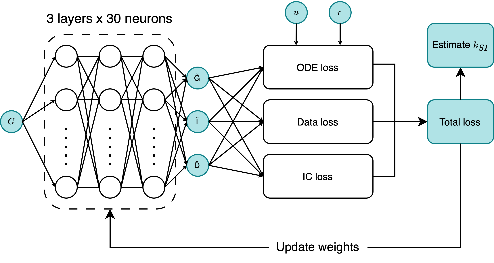
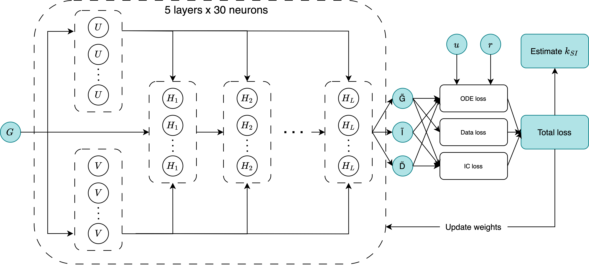
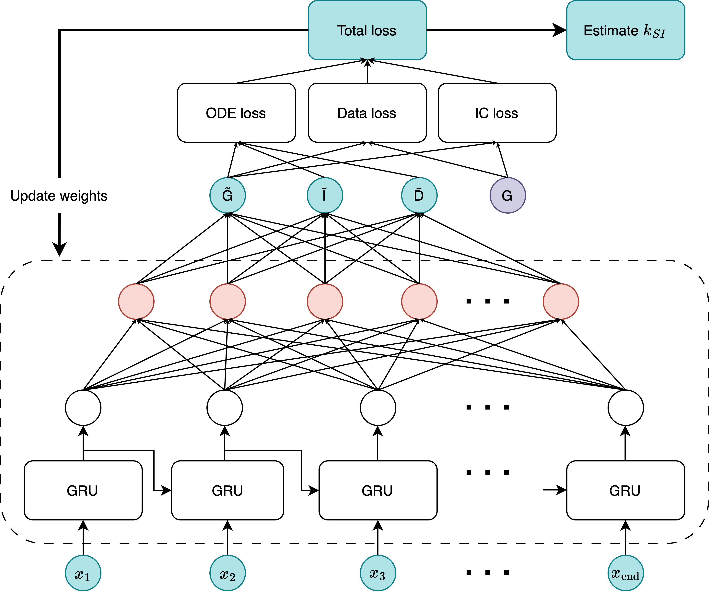

# T1D-PINN: Physics-Informed Neural Networks for Type 1 Diabetes

[](https://github.com/harshith-y/T1D_PINN_Project/actions)
[](https://www.python.org/downloads/)
[](https://tensorflow.org/)
[](https://opensource.org/licenses/MIT)

Predicting blood glucose levels in Type 1 Diabetes using Physics-Informed Neural Networks that embed physiological domain knowledge from the Magdelaine glucose-insulin-carbohydrate model.

## Overview

This project evaluates three distinct PINN architectures for glucose forecasting and inverse physiological parameter estimation under glucose-only supervision:

| Architecture | Framework | Strengths | Best For |
|-------------|-----------|-----------|----------|
| **FNN-PINN** | DeepXDE + TensorFlow | Stable inverse recovery, interpretable | Parameter estimation |
| **Modified MLP** | DeepXDE + TensorFlow | Flexible, handles noisy data | Real-world CGM signals |
| **BI-RNN** | TensorFlow 2.x | Highest accuracy, robust to initialisation | Glucose forecasting |

Each architecture embeds domain knowledge through the [Magdelaine et al. (2015)](https://doi.org/10.1109/TBME.2015.2393105) glucose-insulin framework, enforcing alignment with physiological dynamics while learning from continuous glucose monitoring (CGM) data.

## Architecture

### Physiological Model

The system models glucose-insulin-carbohydrate dynamics using coupled ODEs:

```
dG/dt = -kSI·I + kl - kb + D          (Glucose dynamics)
d²I/dt² + (2/Tu)·dI/dt + I/Tu² = ...  (Insulin absorption)  
d²D/dt² + (2/Tr)·dD/dt + D/Tr² = ...  (Carbohydrate digestion)
```

Where:
- `G(t)`: Blood glucose concentration
- `I(t)`: Plasma insulin
- `D(t)`: Digestion state
- `kSI`: Insulin sensitivity (key parameter for personalisation)

### Model Architectures

#### 1. Feedforward PINN

<p align="center">
  
</p>

- 3 layers × 30 neurons with Fourier feature embeddings
- Hard initial condition enforcement via output transform
- Direct ODE residual supervision in continuous time

#### 2. Modified MLP

<p align="center">
  
</p>

- Dual-path U-V encoding with sigmoid-gated mixing
- 5 hidden layers with adaptive combination at each layer
- Suited for multiscale temporal dynamics

#### 3. Biologically-Informed RNN (BI-RNN)

<p align="center">
  
</p>

- GRU layer (96 units) captures long-range temporal dependencies
- Discretised Euler residual loss for biological supervision
- Autoregressive structure for timestep-wise forecasting

## Results

### Forward Modelling (Glucose Prediction)

| Model | Synthetic RMSE | Real Patient RMSE | Stability (std) |
|-------|---------------|-------------------|-----------------|
| **BI-RNN** | **0.0052** | **0.0019** | **0.014** |
| FNN-PINN | 0.0544 | 0.027 | 0.040 |
| Modified MLP | 0.2366 | 0.059 | 0.072 |

*Lower is better. BI-RNN achieves near-perfect glucose forecasting.*

### Inverse Modelling (Parameter Estimation)

Recovery of insulin sensitivity (kSI) from glucose-only supervision:

| Model | Mean Relative Error | Std | 
|-------|--------------------:|----:|
| **FNN-PINN** | **6.66%** | 21.62% |
| BI-RNN | 3.11%* | 25.15% |
| Modified MLP | 42.69% | 57.35% |
| Random Baseline | 5.70% | 29.19% |

*BI-RNN shows low error but minimal parameter updates from initialisation (<2.53% deviation), indicating poor gradient flow to scalar parameters.*

### Key Findings

1. **BI-RNN** excels at glucose forecasting but struggles with inverse parameter estimation
2. **FNN-PINN** provides the best balance of accuracy and interpretability for parameter recovery
3. **Modified MLP** offers flexibility for noisy real-world data at the cost of stability
4. Physics-informed constraints successfully regularise learning under glucose-only supervision

## Installation

### Prerequisites
- Python 3.9+
- pip or conda

### Setup

```bash
# Clone the repository
git clone https://github.com/harshith-y/T1D_PINN_Project.git
cd T1D_PINN_Project

# Create virtual environment
python -m venv T1D_PINN_venv
source T1D_PINN_venv/bin/activate  # On Windows: T1D_PINN_venv\Scripts\activate

# Install dependencies
pip install -r requirements.txt

# Install package in development mode
pip install -e .
```

### Docker (Optional)

Docker is available for reproducible builds but not required for development:

```bash
docker-compose build
docker-compose run training python scripts/train_inverse.py --config configs/pinn_inverse.yaml --patient 5
```

### Cloud Training (AWS)

For GPU-accelerated training, the project supports AWS EC2 with S3 results storage:

```bash
# On EC2 GPU instance (g4dn.xlarge with Tesla T4)
python scripts/train_inverse.py --config configs/pinn_inverse.yaml --patient 5 --upload-s3

# Results automatically uploaded to S3 bucket
# View via AWS Console or: aws s3 ls s3://your-bucket/
```

**Infrastructure** (managed via Terraform in `terraform/`):
- EC2 g4dn.xlarge with NVIDIA Tesla T4 GPU
- S3 bucket for results storage
- IAM roles for secure access

## Usage

### Training

```bash
# Forward training (glucose prediction)
python scripts/train_forward.py --config configs/birnn.yaml --patient Pat2

# Inverse training (parameter estimation)
python scripts/train_inverse.py --config configs/pinn.yaml --patient Pat2
```

### Evaluation

```bash
# Evaluate trained model
python scripts/evaluate.py --config configs/birnn.yaml --checkpoint results/checkpoints/best.h5

# Generate visualisations
python scripts/visualize.py --results results/experiment_001/
```

### Configuration

Model configurations are defined in YAML files:

```yaml
# configs/birnn.yaml
model:
  type: birnn
  hidden_units: 96
  
training:
  epochs: 500
  learning_rate: 0.01
  loss_weights:
    data: 8.0
    biological: 4.82
    initial_condition: 0.53
```

## Project Structure

```
T1D_PINN_Project/
├── src/
│   ├── models/
│   │   ├── birnn.py              # BI-RNN architecture
│   │   ├── pinn_feedforward.py   # FNN-PINN with DeepXDE
│   │   └── modified_mlp.py       # Modified MLP architecture
│   ├── datasets/
│   │   ├── loader.py             # Unified data loading
│   │   ├── windowing.py          # Training window creation
│   │   ├── preprocessing.py      # Normalisation & scaling
│   │   └── simulator.py          # Synthetic data generation
│   ├── physics/
│   │   └── magdelaine.py         # ODE system implementation
│   ├── training/                 # Training loops & utilities
│   └── visualization/            # Plotting & analysis
├── scripts/                      # CLI entry points
├── configs/                      # YAML configurations
├── tests/                        # Unit & integration tests
├── terraform/                    # AWS infrastructure (EC2, S3)
├── data/
│   ├── synthetic/                # Simulated patient data
│   └── processed/                # Real patient data (not included)
├── Dockerfile                    # Container definition
├── docker-compose.yml            # Simplified training service
├── requirements.txt
└── README.md
```

## Infrastructure

```
┌─────────────────┐     ┌─────────────────┐     ┌─────────────────┐
│  Local Machine  │────▶│   EC2 (GPU)     │────▶│      S3         │
│  (development)  │ SSH │   Training      │     │   Results       │
└─────────────────┘     └─────────────────┘     └─────────────────┘
```

- **Local**: Development, testing, configuration
- **EC2**: GPU training (g4dn.xlarge, Tesla T4)
- **S3**: Results storage and sharing

## Data

### Synthetic Data
- 10 virtual patients (Pat2-Pat11) based on Magdelaine et al. cohort
- 48-hour simulations at 1-minute resolution (2,880 timesteps)
- Full ground truth for G(t), I(t), D(t), and physiological parameters

### Real Patient Data
- CGM data from 5 patients via the [Cockpit platform](https://cockpit-app.com)
- 5-minute glucose readings interpolated to 1-minute resolution
- Insulin and carbohydrate events with precise timestamps

**Note:** Real patient data is confidential and not included in this repository.

## Citation

If you use this code in your research, please cite:

```bibtex
@thesis{yerraguntla2025pinn,
  title={Predicting Blood Glucose Levels in Type 1 Diabetes Using Physics-Informed Neural Networks},
  author={Yerraguntla, Harshith},
  year={2025},
  school={Imperial College London},
  type={MEng Thesis}
}
```

## References

- Magdelaine, N. et al. (2015). "A long-term model of the glucose–insulin dynamics of type 1 diabetes." *IEEE TBME*. [DOI](https://doi.org/10.1109/TBME.2015.2393105)
- De Carli, S. et al. (2025). "Integrating biological-informed recurrent neural networks for glucose-insulin dynamics modeling." [arXiv](https://arxiv.org/abs/2503.19158)
- Raissi, M. et al. (2019). "Physics-informed neural networks." *J. Comp. Physics*. [DOI](https://doi.org/10.1016/j.jcp.2018.10.045)

## Acknowledgements

- **Supervisor:** Dr. Marta Varela (Imperial College London)
- **Co-supervisor:** Dr. Sufyan Hussain
- **Data:** Lukas Schuster and the Cockpit platform

## License

This project is licensed under the MIT License - see [LICENSE](LICENSE) file for details.

---

**Author:** Harshith Yerraguntla  
**Institution:** Imperial College London, Department of Bioengineering  
**Contact:** [GitHub](https://github.com/harshith-y)